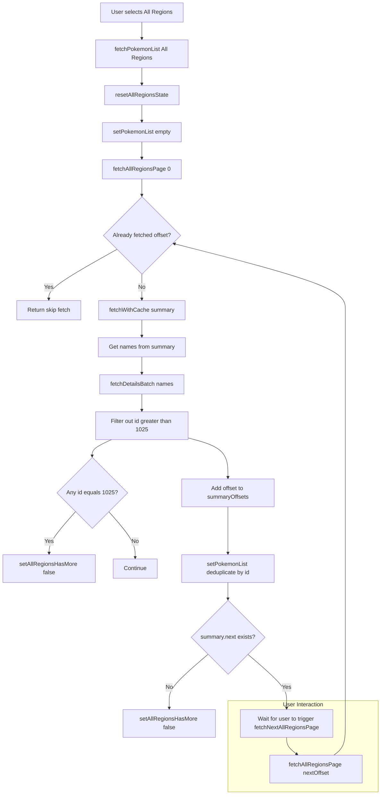

# All Regions Fetch Flow (Pokédex)

This diagram explains how the "All Regions" data fetching logic works in the Pokédex app. It shows the flow from the user's region selection through paginated batch fetching and user-triggered loading of additional batches.

